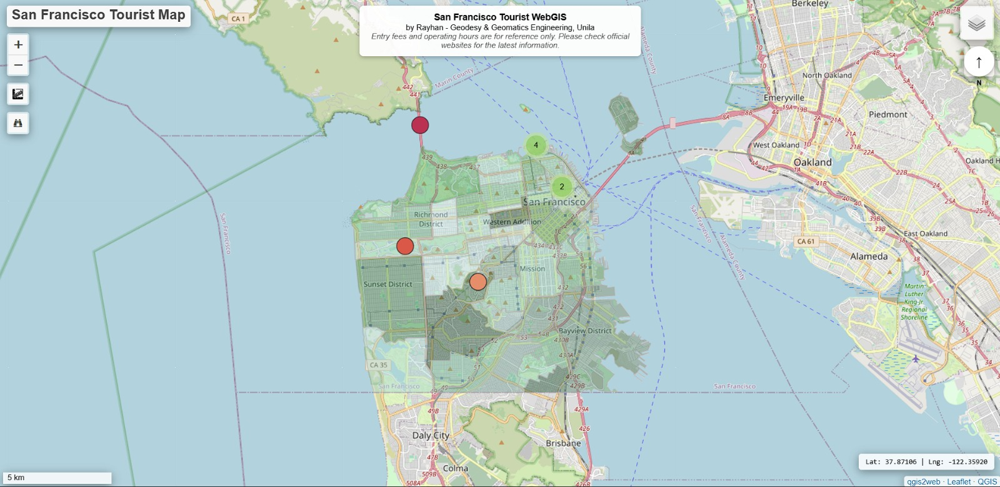

# 🗺️ San Francisco Tourist WebGIS

> Course project — Internet-Based GIS | Geodesy & Geomatics Engineering, Universitas Lampung

An interactive web map showcasing major tourist attractions across San Francisco, CA, with neighborhood boundaries overlaid for geographic context.

## 🌐 Live Demo

👉 **[https://lior-pbl.github.io/sf-tourist-webgis-signet/](https://lior-pbl.github.io/sf-tourist-webgis-signet/)**

---

## 🖼️ Preview



---

## ✨ Features

| Feature | Description |
|---|---|
| 📍 Tourist Attraction Markers | Key attractions with rich info popups |
| 📷 Photo Popups | Photos pulled from Wikimedia Commons |
| 🏘️ Neighborhood Boundaries | SF neighborhood polygons as a reference overlay |
| 🎨 Categorized Markers | Color-coded by attraction type |
| 📏 Dynamic Scale Bar | Scales automatically between meters and kilometers |
| 🔍 Layer Control | Toggle individual layers on and off |
| 📍 Geolocation | Find your current location on the map |
| 🗺️ Basemap Switcher | Switch between OpenStreetMap (default) and Esri World Street Map right from the map |

---

## 🛠️ Built With

- **QGIS 3.x** — Desktop GIS for data preparation and styling
- **qgis2web** — QGIS plugin that exports projects to interactive web maps
- **Leaflet.js** — Lightweight JavaScript library for interactive maps
- **GitHub Pages** — Free static hosting to get the map online

---

## 📂 Repository Structure

```
sf-tourist-webgis-signet/
├── index.html        ← App entry point
├── sfpreview.jpeg    ← Preview screenshot
├── css/              ← Stylesheets (qgis2web export)
├── data/             ← GeoJSON for attraction points & neighborhood polygons
├── images/           ← Supporting image assets
├── js/               ← Leaflet scripts & layer configuration
├── legend/           ← Map legend assets
└── webfonts/         ← Icon fonts (FontAwesome)
```

---

## 📡 Data Sources

| Data | Source |
|---|---|
| Tourist attraction points | Manually digitized |
| Neighborhood polygons | [DataSF Open Data](https://data.sfgov.org/) |
| Attraction photos | [Wikimedia Commons](https://commons.wikimedia.org/) |
| Basemap | OpenStreetMap & Esri World Street Map |

---

## 🚀 Running Locally

This app fetches external basemap tiles, so it needs to be served — don't open the file directly:

```bash
# Python 3
python -m http.server 8000
# Then open: http://localhost:8000
```

> ⚠️ Opening `index.html` via `file://` will likely break the OSM basemap with a 403 error. Use a local server or just visit the live GitHub Pages link above.

---

## 🔧 Troubleshooting

| Issue | Fix |
|---|---|
| Blank or white basemap | Serve locally or use the GitHub Pages URL — don't open via `file://` |
| Photos not showing in popups | Open the browser console and check that photo URLs are HTTPS |
| 404 right after deploying | Give it a few minutes, and make sure `index.html` is at the repo root |
| Updates not showing up | Try a hard refresh: `Ctrl + Shift + R` |

---

## 👤 Author

**Rayhan Dwia Rukmana**  
Student ID: 2315071087  
Geodesy & Geomatics Engineering  
Universitas Lampung

---

*Built as a course project for Internet-Based GIS*
